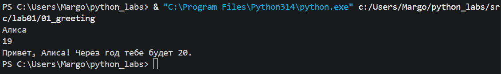
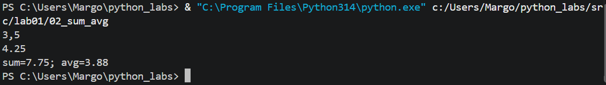
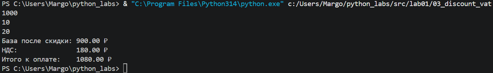
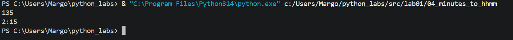
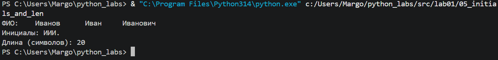
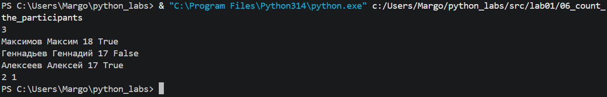
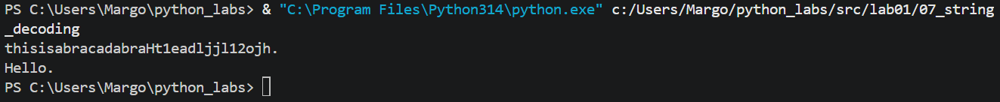

# ЛР1 — Ввод/вывод и форматирование
### Задание 1
Прием  данных и вывод приветствия с расчетом возраста через год

### Задание 2
Расчет суммы и среднего значения вещественных чисел с округлением до двух знаков с помощью f-строк

### Задание 3
По формулам последовательно вычисляются базовая стоимость со скидкой, сумма НДС и итоговая сумма к оплате. Результаты выводятся построчно с округлением до двух знаков после запятой

### Задание 4
Программа переводит общее количество минут в часы (через целочисленное деление на 60) и остаток минут (через остаток от деления на 60)

### Задание 5
1. **Очистка и разбиение строки:** split() разбивает введенную строку ФИО по пробелам, автоматически удаляя любые лишние пробелы
2. **Формирование инициалов:** Берутся первые буквы каждого слова (`w[0]`) и склеиваются в одну строку
3. **Расчет длины:** Исходная строка пересобирается через `' '.join(words)` с одиночными пробелами, после чего вычисляется ее корректная длина с помощью функции `len()`

### Задание 6
1. Считывается число строк `N`, а также создаются счетчики для очной (`offline`) и заочной (`online`) форм обучения
2. В цикле `for` каждая строка разбивается на элементы. Последний элемент (`line[-1]`), отвечающий за формат участия, проверяется на равенство строке `True`
3. При совпадении с `True` увеличивается счетчик очников, в противном случае — заочников

### Задание 7: Декодирование строки
1. **Поиск начала данных:** Программа считывает закодированную строку и находит индекс первой заглавной буквы
2. **Определение шага:** Находится индекс первой цифры, следующей за этой буквой, а затем и индекс второй буквы закдированной строки, на основе чего вычисляется межсимвольный интервал
3. **Декодирование:** Начиная с первой найденной буквы, программа извлекает символы с шагом интервала и собирает их в исходную строку до тех пор, пока не встретит точку

