# ЛР1 — Ввод/вывод и форматирование
### Задание 1
Прием  данных и вывод приветствия с расчетом возраста через год

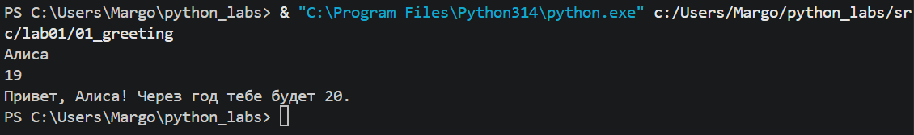

### Задание 2
Расчет суммы и среднего значения вещественных чисел с округлением до двух знаков с помощью f-строк

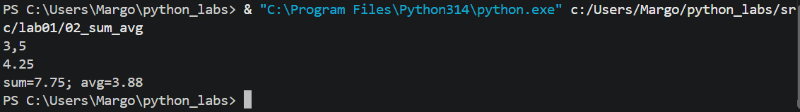

### Задание 3
По формулам последовательно вычисляются базовая стоимость со скидкой, сумма НДС и итоговая сумма к оплате. Результаты выводятся построчно с округлением до двух знаков после запятой

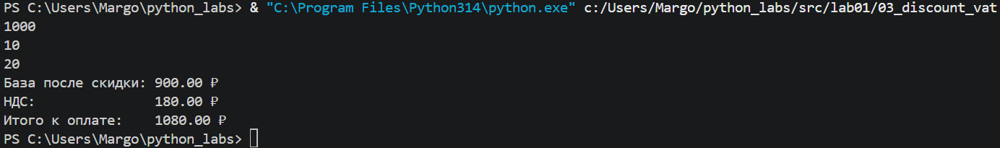

### Задание 4
Программа переводит общее количество минут в часы (через целочисленное деление на 60) и остаток минут (через остаток от деления на 60)

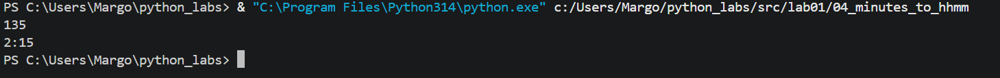

### Задание 5
1. **Очистка и разбиение строки:** split() разбивает введенную строку ФИО по пробелам, автоматически удаляя любые лишние пробелы
2. **Формирование инициалов:** Берутся первые буквы каждого слова (`w[0]`) и склеиваются в одну строку
3. **Расчет длины:** Исходная строка пересобирается через `' '.join(words)` с одиночными пробелами, после чего вычисляется ее корректная длина с помощью функции `len()`

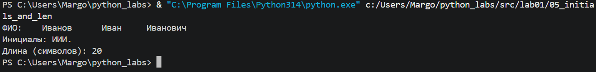

### Задание 6
1. Считывается число строк `N`, а также создаются счетчики для очной (`offline`) и заочной (`online`) форм обучения
2. В цикле `for` каждая строка разбивается на элементы. Последний элемент (`line[-1]`), отвечающий за формат участия, проверяется на равенство строке `True`
3. При совпадении с `True` увеличивается счетчик очников, в противном случае — заочников

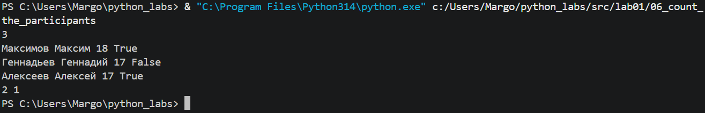

### Задание 7: Декодирование строки
1. **Поиск начала данных:** Программа считывает закодированную строку и находит индекс первой заглавной буквы
2. **Определение шага:** Находится индекс первой цифры, следующей за этой буквой, а затем и индекс второй буквы закдированной строки, на основе чего вычисляется межсимвольный интервал
3. **Декодирование:** Начиная с первой найденной буквы, программа извлекает символы с шагом интервала и собирает их в исходную строку до тех пор, пока не встретит точку

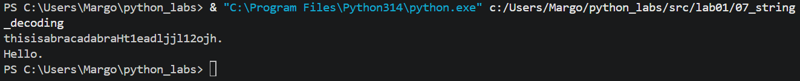

---

# ЛР2 - Коллекции и матрицы (list/tuple/set/dict)
### Задание 1 (arrays.py)
### min_max
```python
def min_max(nums: list[float | int]) -> tuple[float | int, float | int]:
    minn = 10**17
    maxx = -10**17
    if not nums:
        raise ValueError
    for x in nums:
        if x<minn:
            minn=x
        if x>maxx:
            maxx=x
    return minn, maxx
```
1. **Проверка на пустой список:** Проверяем переданную структуру данных. Если она не содержит элементов, генерируется исключение `raise ValueError`.
2. **Линейный обход:** В цикле `for` выполняется последовательное сравнение каждого элемента списка. Значения переменных перезаписываются при нахождении нового минимума или максимума.
3. **Возврат результата:** По завершении обхода функция возвращает кортеж формата `(минимум, максимум)`.

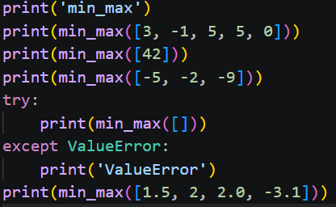
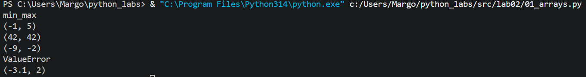

### unique_sorted
```python
def unique_sorted(nums: list[float | int]) -> list[float | int]:
    nums = list(set(nums))
    flag = True
    while flag:
        flag = False
        for i in range(len(nums)-1):
            if nums[i]>nums[i+1]:
                nums[i], nums[i+1] = nums[i+1], nums[i]
                flag = True
    return nums
```
1. **Фильтрация дубликатов:** Переданный список `nums` преобразуется во множество `set(nums)`, что автоматически удаляет все повторяющиеся элементы, после чего снова приводится к типу `list`.
2. **Cортировка:** Очищенный от дубликатов список сортируется вручную. Переменная `flag` отслеживает, были ли перестановки элементов во время текущего прохода по списку.
3. **Линейное сравнение и перестановка:** Вложенный цикл `for` сравнивает соседние элементы (`nums[i]` и `nums[i+1]`). Если текущий элемент больше следующего, они меняются местами, а флаг принимает значение `True` для запуска следующей итерации `while`.
4. **Возврат результата:** Алгоритм завершается, когда список полностью упорядочен (проход выполняется без единой перестановки), и функция возвращает отсортированный массив уникальных значений.

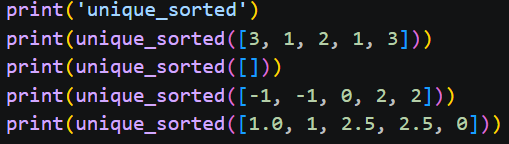
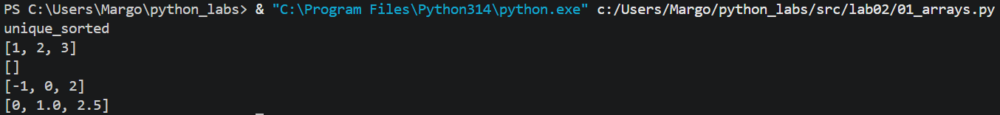

### flatten
```python
def flatten(mat: list[list | tuple]) -> list:
    result = []
    for i in mat:
        if isinstance(i, (list, tuple)):
            result += i
        else:
            raise TypeError
    return result
```
1. Создается пустой список `result`, в который последовательно будут собираться элементы из вложенных структур.
2. **Проверка типов:** В цикле `for` программа перебирает элементы внешнего списка `mat`. На каждой итерации встроенная функция `isinstance(i, (list, tuple))` проверяет, является ли текущий элемент списком или кортежем.
3. **Объединение коллекций:** Если проверка пройдена успешно, вложенная структура приводится к типу `list` и добавляется в конечный список.
4. **Валидация структуры:** Если обнаруживается элемент другого типа (например, строка или число), выполнение прерывается инструкцией `raise TypeError`. По завершении корректного обхода функция возвращает список.

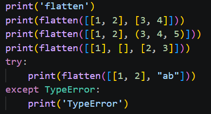
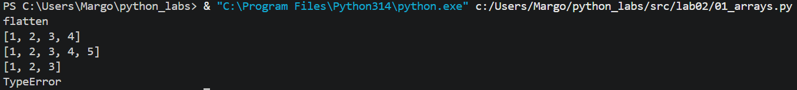

---

### Задание 2 (matrix.py)
### transpose
```python
def transpose(mat: list[list[float | int]]) -> list[list]:
    if any(len(mat[i])!=len(mat[i+1]) for i in range(len(mat)-1)):
        raise ValueError
    result = []
    if len(mat)>0:
        for i in range(len(mat[0])):
            result.append([mat[j][i] for j in range(len(mat))])
    return result
```
1. **Валидация прямоугольности:** С помощью выражения внутри `any()` проверяется равенство длин всех соседних строк матрицы. Если найдено несоответствие, генерируется ошибка `raise ValueError`.
2. **Инициализация:** Создается пустой список `result` для будущей транспонированной матрицы.
3. **Обход по столбцам:** Внешний цикл итерируется по индексам элементов первой строки.
4. **Сборка новых строк:** С помощью спискового включения `[mat[j][i] for j in range(len(mat))]` элементы текущего столбца из всех строк `j` собираются в новую строку и добавляются в `result`.

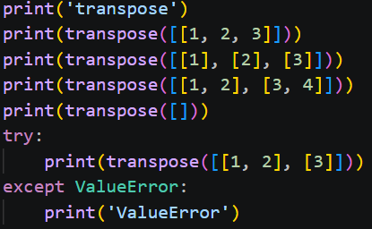
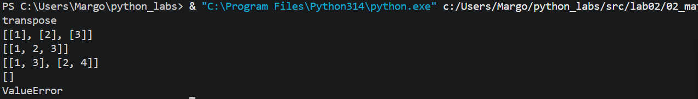

### row_sums
```python
def row_sums(mat: list[list[float | int]]) -> list[float]:
    if any(len(mat[i])!=len(mat[i+1]) for i in range(len(mat)-1)):
            raise ValueError
    return [sum(i) for i in mat]
```
1. **Валидация прямоугольности:** С помощью выражения внутри `any()` проверяется равенство длин всех соседних строк матрицы. Если найдено несоответствие, генерируется ошибка `raise ValueError`.
2. С помощью `[sum(i) for i in mat]` программа последовательно берет каждую подстроку `i` из матрицы `mat`, передает её во встроенную функцию `sum()` и формирует итоговый одномерный список сумм.

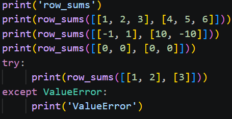
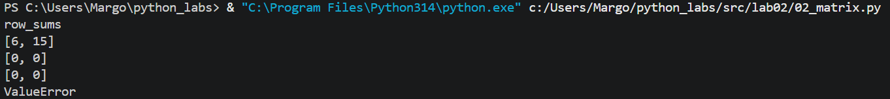

### col_sums
```python
def col_sums(mat: list[list[float | int]]) -> list[float]:
    if any(len(mat[i])!=len(mat[i+1]) for i in range(len(mat)-1)):
                raise ValueError
    return [sum([mat[j][i] for j in range(len(mat))]) for i in range(len(mat[0]))]
```
1. **Валидация прямоугольности:** С помощью выражения внутри `any()` проверяется равенство длин всех соседних строк матрицы. Если найдено несоответствие, генерируется ошибка `raise ValueError`.
2. **Вертикальное суммирование:** Через вложенное списковое включение внешний цикл `for i` задает индекс текущего столбца.
3. **Расчет значений:** Внутренний цикл `for j` извлекает элементы из каждой строки `j` для выбранного столбца `i`, формируя временный список, который сразу передается в функцию `sum()` для подсчета итогового значения столбца.

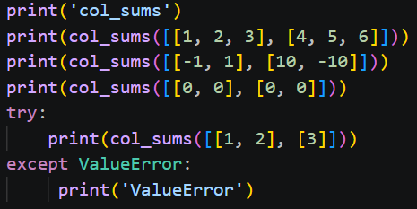
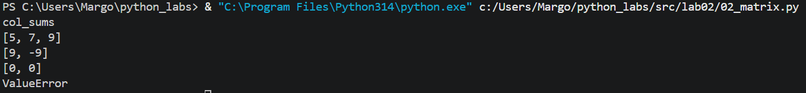

---

### Задание 3 (tuples.py)
```python
def format_record(rec: tuple[str, str, float]) -> str:
    """
    Форматирует кортеж с данными студента в строку.
    
    :rec: Кортеж вида (fio, group, gpa)
    :raise TypeError: Если типы элементов кортежа не соответствуют (str, str, float/int).
    :raise ValueError: Если ФИО или группа пустые после очистки, или GPA вне диапазона [0.0, 5.0].
    :return: Сформированная строка по шаблону.
    """
    if not isinstance(rec, tuple) or len(rec) != 3:
        raise TypeError("Запись должна быть кортежем из 3 элементов")
    fio, group, gpa = rec
    if not isinstance(fio, str) or not isinstance(group, str):
        raise TypeError('ФИО и группа должны быть строками')
    if not isinstance(gpa, (int, float)):
        raise TypeError("GPA должен быть числом")

    fio = fio.split() 
    fio_clean = " ".join(fio)
    if fio_clean == "":
        raise ValueError("ФИО не может быть пустой строкой")
    if group == "":
        raise ValueError("Группа не может быть пустой строкой")
    if not (0.0 <= gpa <= 5.0):
        raise ValueError("GPA должен быть в диапазоне от 0.0 до 5.0")
    
    fio1 = fio[0][0].upper() + fio[0][1:] + " "
    for i in range(len(fio)):
        if i!=0:
            fio1 += fio[i][0].upper() + '.'
    return f"{fio1}, гр. {group.strip()}, GPA {gpa:.2f}"
```
1. **Строгая валидация типов:** Функция проверяет структуру кортежа на длину и типы данных всех трех полей (`str`, `str`, `int/float`). При несоответствии выбрасывается исключение `TypeError`.
2. **Очистка данных:** С помощью `.split()` строка ФИО разбивается по пробелам, что эффективно убирает любые лишние и внутренние дублирующиеся пробельные символы. Пустые значения полей и выход `gpa` за границы `[0.0; 5.0]` вызывают исключение `ValueError`.
3. **Генерация инициалов:** Из полученного списка слов формируется новая строка: первая буква фамилии приводится к верхнему регистру (`.upper()`), а последующие элементы (имя и отчество при наличии) итерируются в цикле, преобразуясь в заглавные буквы с точками.
4. **Вывод результата:** Итоговая строка собирается через f-строку, где пробелы в названии группы зачищаются методом `.strip()`, а оценка округляется ровно до двух знаков после запятой при помощи спецификатора `:.2f`.

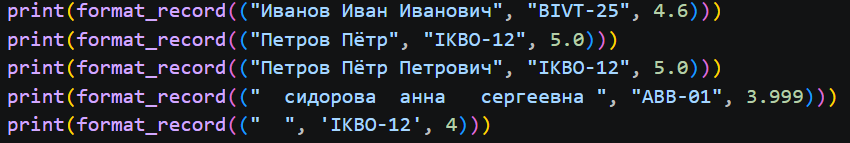
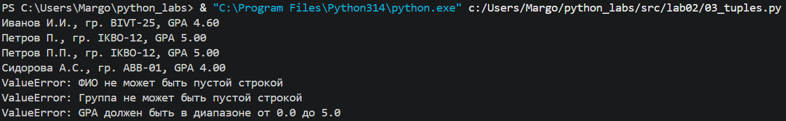

---

# ЛР3 - Тексты и частоты слов (словарь/множество)
### Задание А
```python
import re

def normalize(text: str, *, casefold: bool = True, yo2e: bool = True) -> str:
    """Привести текст к нормальной форме.

    Шаги нормализации:
      1. Регистр: ``casefold()``.
      2. Если ``yo2e=True`` — заменить ``ё``/``Ё`` на ``е``/``Е``.
      3. Заменить управляющие символы ``\\t``, ``\\r``, ``\\n`` на пробелы.
      4. «Схлопнуть» подряд идущие пробелы в один и обрезать края.
    """

    new_text = text
    # 1. Регистр
    if casefold:
        new_text = new_text.casefold()
    # 2. ё -> е
    if yo2e:
        new_text = new_text.replace('ё', 'е').replace('Ё', 'Е')
    # 3. Управляющие символы -> пробел
    for x in ("\t", "\r", "\n"):
        text = text.replace(x, " ")
    # 4. Схлопываем пробелы
    new_text = ' '.join(new_text.split())
    return new_text


def tokenize(text: str) -> list[str]:
    """Разбить текст на слова.

    Слово — это шаблон ``\\w+(?:-\\w+)*``: буквы/цифры/подчёркивание,
    при этом внутри слова допускается дефис. Всё остальное (пробелы,
    знаки препинания, эмодзи, длинное тире ``—``) — разделители.
    Числа считаются словами.
    """

    return [match.group() for match in re.finditer(r"\w+(?:-\w+)*", text)]


def count_freq(tokens: list[str]) -> dict[str, int]:
    """Подсчитать сколько раз каждое слово встречается в списке токенов.
    Возвращает словарь вида {слово: количество}.
    """
    freq = {}
    for token in tokens:
        # get(token, 0) возвращает текущий счётчик или 0 для нового слова.
        freq[token] = freq.get(token, 0) + 1
    return freq


def top_n(freq: dict[str, int], n: int = 5) -> list[tuple[str, int]]:
    """Вернуть N самых частых слов.

    Пары ``(слово, частота)`` сортируются по ключу ``(-частота, слово)``:
    сначала по убыванию частоты, а при равенстве частот — по алфавиту.
    """

    return sorted(freq.items(), key=lambda x: (-x[1], x[0]))[:n]
```
1. `normalize`: Приводит входную строку к единому регистру через метод `.casefold()`, осуществляет склеивание букв `ё` и `е`, заменяет спецсимволы (`\n`, `\t`, `\r`) на пробелы, после чего «схлопывает» множественные пробелы с помощью комбинации функций `.split()` и `' '.join()`.
2. `tokenize`: Извлекает слова из очищенного текста при помощи регулярного выражения `\w+(?:-\w+)*`, которое учитывает буквы, цифры и внутренние дефисы, при этом отсекая знаки препинания и эмодзи.
3. `count_freq`: Проходит по сформированному списку токенов и аккумулирует их количество в словаре методом `.get(token, 0)`, страхующим от ошибок отсутствия ключа.
4. `top_n`: Сортирует пары «слово-частота» встроенной функцией `sorted()` с использованием ключа сравнения `lambda x: (-x[1], x[0])`. Это обеспечивает упорядочивание по убыванию частоты, а при её равенстве — по алфавиту.

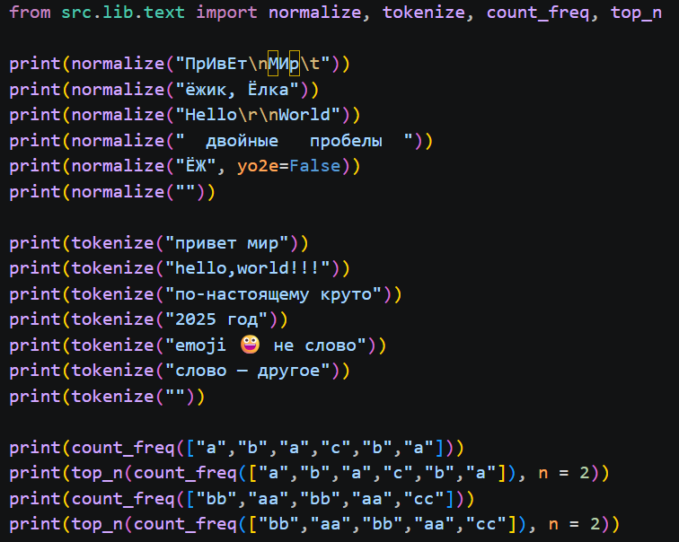
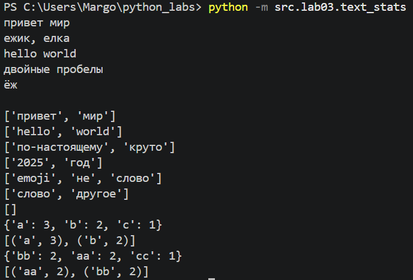

---

### Задание В
```python
import sys
from src.lib.text import normalize, tokenize, count_freq, top_n

def main() -> None:
    raw_text = sys.stdin.read()

    tokens = tokenize(normalize(raw_text))
    freq = count_freq(tokens)
    total_words = len(tokens)
    unique_words = len(freq)
 
    print(f"Всего слов: {total_words}")
    print(f"Уникальных слов: {unique_words}")
    print("Топ-5:")
 
    for word, count in top_n(freq, 5):
        print(f"{word}: {count}")
 
 
if __name__ == "__main__":
    main()
```
1. **Чтение потока:** Конструкция `sys.stdin.read()` позволяет полностью считать многострочный текст, передаваемый пользователем через консоль.
2. **Конвейер обработки:** Прочитанные сырые данные последовательно пропускаются через разработанную цепочку функций: `normalize -> tokenize -> count_freq`.
3. **Расчет метрик:** Общее число слов определяется через размер списка токенов (`len(tokens)`), а число уникальных слов — через размер словаря частот (`len(freq)`).
4. **Консольный вывод:** Скрипт печатает базовую информацию и выводит в цикле итоговый частотный список Топ-5 элементов.

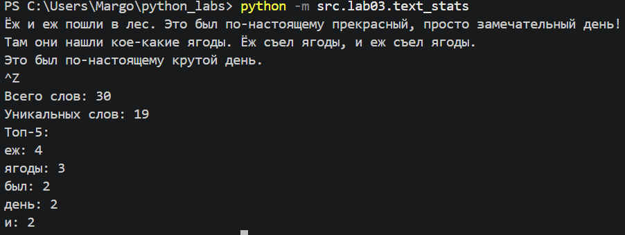